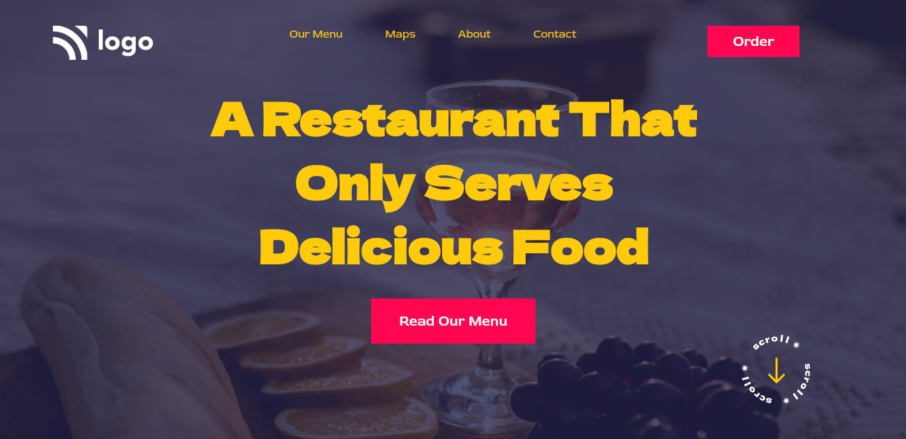

# Restaurant Food Page

- This is my second project.In this project adding colour to the background image took lot of time because it was some how not working and after sometime i found out that my syntax was wrong.It was a small error but it took lot of time to solve.

- I made this project in 3-4hr and i took most of the time for adjusting font size, background color and padding.The link of the project is below:

---

## Screenshot

---

## 🛠 Skills learned

HTML, CSS

---

## 🚀 About Me

### Hey, I am Yasir lambawala

- I am born and brought up in Vadodara, Gujarat. I have done my Btech at GTU university and I am currently learning Web-development.

---

## Feedback

- If you have any feedback, please reach me at lambawalay@gmail.com
